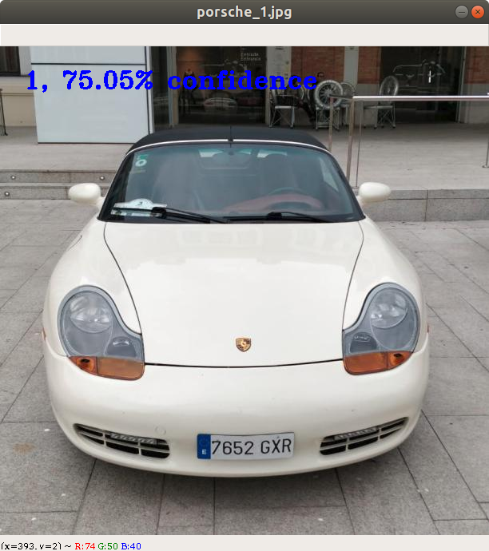
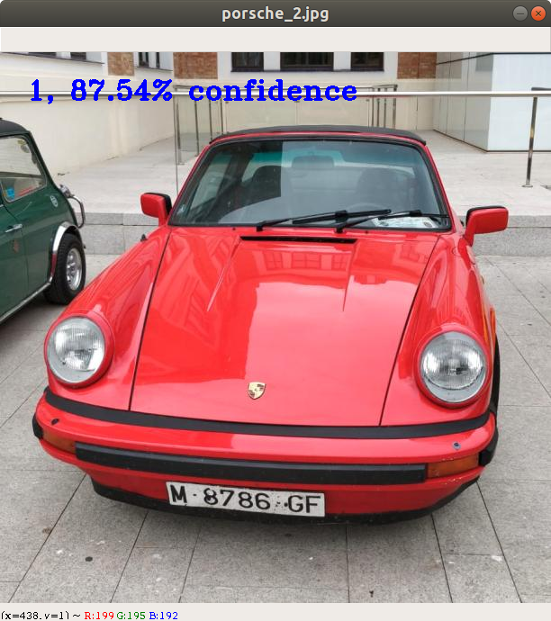
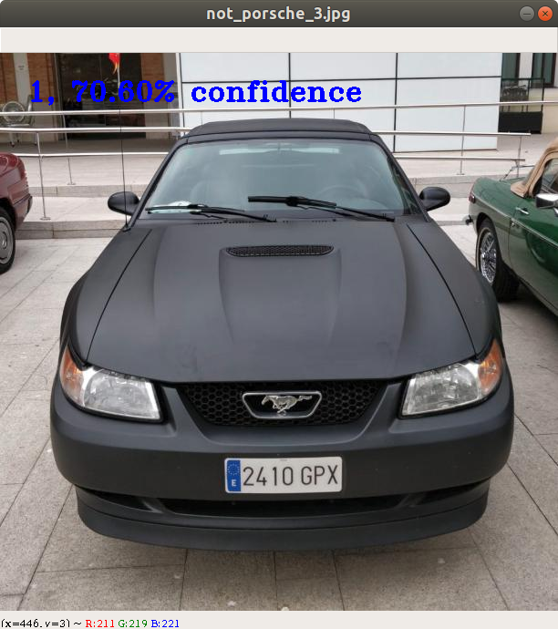
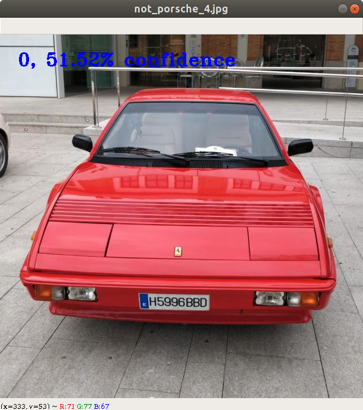

# Reto Porsche

Este reto consiste en clasificar imágenes de vehículos según sean del fabricante Porsche o no. Para ello se proporciona
un conjunto de 200 imágenes de partida.


## Propuesta de solución

El enfoque seguido para solucionar este reto consiste en la utilización de una red neuronal. En concreto, utilizaremos
la red neuronal Inception v3 de Google. Esta red está especialmente indicada para la extracción de características de
las imágenes. A esta red le incorporaremos dos capas adicionales después de la salida de manera que podamos establecer
una regla de asociación entre las características de la imagen y el valor de salida que deseamos. Las clases de
equivalencia que utilizamos en las imágenes son 0 para indicar que el vehículo no es del fabricante Porsche y 1 en caso
contrario.

El código que presentamos es la combinación de algunos proyectos encontrados así como otras aportaciones de creación
propia para adecuarnos a nuestro problema concreto.

Respecto a la elección de herramientas hemos optado por el lenguaje de programación Python y la biblioteca de redes
neuronales Tensorflow.


## Sobre el tamaño del dataset

Contamos con un conjunto de 200 imágenes de partida. Esto es insuficiente para entrenar a la red neuronal. Ocurre que
con un conjunto de datos tan pequeño nuestra red no tendrá capacidad de generalización y puede que se especialice
demasiado en el conjunto de entrenamiento pero no pueda resolver satisfactoriamente imágenes del conjunto de test.

Este es el punto más crítico en los algoritmos de aprendizaje pues la calidad en el resultado de la clasificación
vendrá fuertemente determinado por el tamaño de los datos.

Como no contamos con más imágenes podemos recurrir a una técnica conocida como *data augmentation* que consiste en
realizar modificaciones sobre el conjunto de base para dar lugar a otras imágenes con las que nutrir nuestro algoritmo
de aprendizaje. Nos valdremos de la biblioteca Augmentor de Python.


## Requisitos

Todas las dependencias de este proyecto se encuentran listadas en el archivo requirements.txt. Se recomienda utilizar
un entorno virtual de Python para no cargar bibliotecas en el sistema base.


## Ejecución

A continuación los pasos que hay que seguir para ejecutar el algoritmo:


### Separar los datos de partida

Lo primero que haremos será separar los datos colocándolos en un directorio diferente según la clasificación. Así,
ejecutaremos el siguiente script que separa los datos en los directorios 0 y 1 para referirse a imágenes tales que no
contentan coches de la marca Porsche o sí los contengan.

```
python split_dataset.py
```


### Aumentar los datos

Para aumentar los datos de partida ejecutamos el siguiente script, que creará una muestra de 1000 imágenes para cada
una de las clasificaciones, es decir, creará esa cantidad de imágenes relativas a vehículos que no son de la marca
Porsche y para los que sí lo son.

```
python augment_dataset.py
```


### Entrenar la red neuronal

Utilizamos el modelo Inception v3 de Google que ya posee un número de capas entrenadas. Nosotros reentrenamos el modelo
en las capaz agregadas a su salida para conseguir el resultado que deseamos. El script a utilizar para entrenar la red
neuronal es como sigue:

```
python retrain.py --bottleneck_dir="./tf_files" --how_many_training_steps=500 --model_dir="./tf_files" --output_graph="./tf_files/retrained_graph.pb" --output_labels="./tf_files/retrained_labels.txt" --image_dir="./training_images"
```


### Probar el modelo entrenado

Por último podemos utilizar el modelo entrenado para evaluar las imágenes del conjunto de test.

```
python test.py
```










### Sobre la precisión en los resultados

La precisión de la red neuronal no es todo lo buena que se desearía. Hay que aumentar el tamaño de datos de
entrenamiento pero no de forma artificial a base de técnicas como el *data augmentation*. También podría jugarse con
conceptos para afinar más la precisión de la red neuronal. En concreto, podemos tener en cuenta cuestiones como que el
conjunto de datos posibles es tal que habrá más imágenes con coches no Porsche que lo contrario. Así, podemos
establecer un umbral y si nuestro algoritmo no está seguro de que la imagen se refiere a un Porsche (porque el
resultado queda por debajo del umbral), entonces se concluye que la imagen no contiene un Porsche.

Se puede realizar un análisis más profundo y mejorar los resultados pero por limitación temporal estas opciones quedan
fuera del objetivo que se persigue en este prototipo.


### Notas

Este proyecto ha sido realizado por Javier Matos para presentar al Hackathon de Ocupa2.
